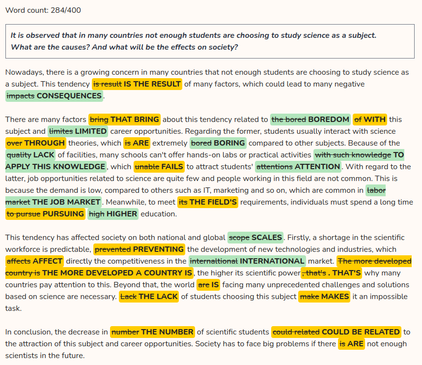
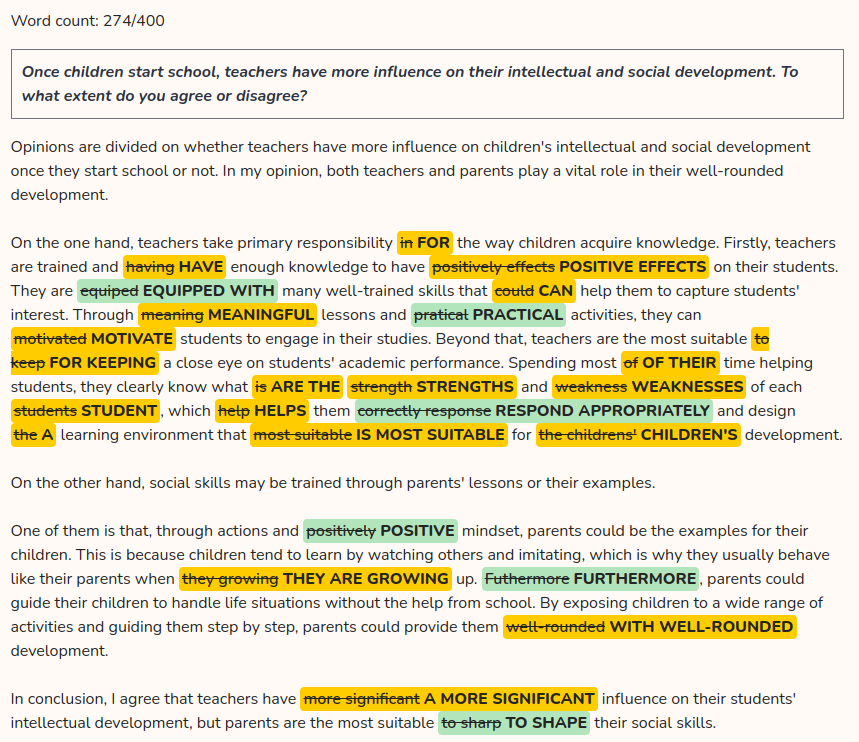

# Writing

## Catalogue

- [Writing](#writing)
  - [Catalogue](#catalogue)
  - [Summary](#summary)
    - [Argumentative/Opinion/Agree or Disagree Essay](#argumentativeopinionagree-or-disagree-essay)
    - [Advantages and Disadvantages Essay](#advantages-and-disadvantages-essay)
    - [Discussion Essay/Discuss both views](#discussion-essaydiscuss-both-views)
    - [Causes and Effects/Causes and Solutions/Problems and Solutions Essay](#causes-and-effectscauses-and-solutionsproblems-and-solutions-essay)
    - [Two-Part Question Essay](#two-part-question-essay)
  - [Part 1](#part-1)
  - [Part 2](#part-2)
    - [Young people are now spending more and more time and money following fashion trends. Is this a positive or negative development?](#young-people-are-now-spending-more-and-more-time-and-money-following-fashion-trends-is-this-a-positive-or-negative-development)
    - [Employers should give longer holidays to employees to encourage them to do their job well. To what extent do you agree or disagree?](#employers-should-give-longer-holidays-to-employees-to-encourage-them-to-do-their-job-well-to-what-extent-do-you-agree-or-disagree)
    - [People nowadays sleep less than they used to in the past. What do you think is the reason for this? What are the effects of this habit?](#people-nowadays-sleep-less-than-they-used-to-in-the-past-what-do-you-think-is-the-reason-for-this-what-are-the-effects-of-this-habit)
    - [Goverments should spend money on railways rather than roads. To what extent do you agree or disagree with this statement?](#goverments-should-spend-money-on-railways-rather-than-roads-to-what-extent-do-you-agree-or-disagree-with-this-statement)
    - [Nowadays people depend on technology for leisure activities. Is this a positive or negative development?](#nowadays-people-depend-on-technology-for-leisure-activities-is-this-a-positive-or-negative-development)
    - [While many people go to university for academic study, more people should be encouraged to do vocational training because there is a lack of qualified workers such as electricians and plumbers. Agree or disagree?](#while-many-people-go-to-university-for-academic-study-more-people-should-be-encouraged-to-do-vocational-training-because-there-is-a-lack-of-qualified-workers-such-as-electricians-and-plumbers-agree-or-disagree)
    - [Many people want their country to host an international sporting event. Others believe that international sporting events bring more problems than benefits. Discuss both views and give your opinion](#many-people-want-their-country-to-host-an-international-sporting-event-others-believe-that-international-sporting-events-bring-more-problems-than-benefits-discuss-both-views-and-give-your-opinion)
    - [Nowadays, there is a growing trend for men to stay at home and take care of their children while their spouses go out to work. There are some reasons for this tendency to become more popular and I believe this trend is beneficial in many ways](#nowadays-there-is-a-growing-trend-for-men-to-stay-at-home-and-take-care-of-their-children-while-their-spouses-go-out-to-work-there-are-some-reasons-for-this-tendency-to-become-more-popular-and-i-believe-this-trend-is-beneficial-in-many-ways)
    - [It is observed that in many countries not enough students are choosing to study science as a subject. What are the causes? And what will be the effects on society?](#it-is-observed-that-in-many-countries-not-enough-students-are-choosing-to-study-science-as-a-subject-what-are-the-causes-and-what-will-be-the-effects-on-society)
    - [Once children start school, teachers have more influence on their intellectual and social development. To what extent do you agree or disagree?](#once-children-start-school-teachers-have-more-influence-on-their-intellectual-and-social-development-to-what-extent-do-you-agree-or-disagree)

## Summary

IELTS Writing Task 2 includes 5 types of essays:

- **Argumentative/Opinion/Agree or Disagree Essay**
  - Give you 1 opinion and you need to discuss it. You also need to give your opinion.
  - Do you agree or disagree?
  - To what extent do you agree or disagree?
  - Is this a positive or negative development?
  - Some people think that all teenagers should be required to do unpaid work in their free time to help the local community. They believe this would benefit both the individual teenager and society as a whole. Do you agree or disagree?
- **Discussion Essay/Discuss both views**
  - It'll give you 2 opinions and you need to discuss both of them, including your opinion.
  - Discuss both these views and give your opinion.
- **Advantages and Disadvantages Essay**
  - It'll give you 1 topic and you need to discuss the advantages and disadvantages of it.
  - "Do the advantages of this outweigh the disadvantages?" -> **GIVE YOUR OPINION**
  - "Discuss the advantages and disadvantages of this?" -> **DO NOT GIVE YOUR OPINION**
- **Causes and Effects/Causes and Solutions/Problems and Solutions Essay**
  - The easiest type of essay in this test.
  - The internet has transformed the way information is shared and consumed, but it has also created problems that did not exist before. What are the most serious problems associated with the Internet and what solutions can you suggest?
- **Two-Part Question Essay**
  - Many people decide on a career path early in their lives and keep to it. This, they argue, leads to a more satisfying working life. To what extent do you agree with this view? What other things can people do in order to have a satisfying working life?

### Argumentative/Opinion/Agree or Disagree Essay

- Introduction (Mở bài)
  - Background Sentence (Paraphrase lại câu hỏi)
    - > It is believed that ...
  - Thesis Statement (Nêu quan điểm của bạn)
    - > I completely agree/disagree with this idea ...
    - > In my opinion, I disagree with this view.
    - > From my point of view, I partly agree/disagree with this view.
  - Outline Statement (Nếu lý do bạn ủng hộ quan điểm này)
- Main body - Paragraph 1 (Đoạn thân bài 1)
  - Topic Sentence (Câu chủ đề, nêu luận điểm 1)
  - Explain Topic Sentence (Giải thích)
  - Example (Cung cấp ví dụ chứng minh)
- Main body - Paragraph 2 (Đoạn thân bài 2)
  - Topic Sentence (Câu chủ đề, nêu luận điểm 1)
  - Explain Topic Sentence (Giải thích)
  - Example (Cung cấp ví dụ chứng minh)
- Conclusion (Kết luận)
  - Summary and reiteration of your opinion. (Tóm tắt các luận điểm đã nêu bên trên)

### Advantages and Disadvantages Essay

- You shoud base on 40/60 approach
  - 40% for the opposite side
  - 60% for your side
- You should have 4 ideas in total
  - 2 ideas for the opposite side
  - 2 ideas for your side
- **MUST** have a clear opinion and express it in the introduction and conclusion

**Structure:**

- **Introduction** (about 2-3 sentences)
  - > Nowadays, there is a growing concern about ...
  - > Opinions are divided on whether ...
  - > I completely agree/disagree with the idea of ... due to two main reasons.
  - > Although it may breing about certain negative impacts, the benefits outweigh them.
  - > There are several advantages/disadvantages to doing STH
  - > It’s beneficial/advantages/disadvantages for SB to do STH
  - > DOING STH is more beneficial to SB for reasons related to/regarding OPPORTUNITIES and FINANCIAL BENEFITS.

- **Body Paragraph 1**
  - Topic Sentence
    - > Admittedly, ... may bring certain ... to ... related to ... and ...
    - > On the one hand...
  - Core Idea 1
    - > One of them is that, ...
    - > Regarding the former, ...
    - > Firstly, ...
    - > Regarding (N), ...
  - Supporting Idea 1
    - > For example, ...
  - Core Idea 2
    - > Moreover, ...
    - > Another reason is that ...
    - > Furthermore, ...
    - > In addition, ...
    - > In addition to this, ...
    - > Secondly, ...
    - > Regarding the latter, ...
    - > Regarding (N), ...
    - > Additionally,
    - > Furthermore,
    - > With regard to the latter,...

  - Supporting Idea 2
    - > This is because ...
- **Body Paragraph 2** (Same as Body Paragraph 1)
  - Topic Sentence
    - > On the other hand, ...
- **Conclusion** (about 2-3 sentences)
  - > In conclusion, even though there are some drawbacks to ..., the benefits of ... outweigh them.
  - ...
  - > Based on the aforementioned arguments, I completely agree with the proposed idea.

### Discussion Essay/Discuss both views

- You must give your opinion if required
- Each body paragraph should discuss one view

### Causes and Effects/Causes and Solutions/Problems and Solutions Essay

- Problem + Reason + Solution
- It'll ask you to discuss 2 of them
  - What problems are associated with this, and what are some possible solutions? (Problem + Solution)
- You must prepare 2 problems and 2 solutions
  - each body have 1 problem and 1 solution
  - **or** 2 problems in one body and 2 solutions in the other body

### Two-Part Question Essay

- Each body part is a separate question

## Part 1

## Part 2

### Young people are now spending more and more time and money following fashion trends. Is this a positive or negative development?

> Admittedly, there are several advantages to spending a lot of time and money following fashion trends related to quality of life and creation in work. For some people who have a passion for fashion, updating the latest trends every day helps them become more confident, which becomes a kind of entertainment for a large part of the young generation nowadays. This is because these newest models usually help their owners feel that they are the most attractive ones among the crowd, making these people produce more happiness hormones in their brains when they wear them. Additionally, these works of art are usually creative with strange shapes or have eye-catching looks, inspiring a lot of people, especially those who work in the art field. With them, creation is the most important thing and they are willing to pay any price as long as it can bring more creativity and productivity to their work.
>
> On the other hand, trying to own the latest fashion trends is having potential drawbacks for many people, especially the young generation. These good-looking items just have temporary value for their owners' appearance, which will be outdated soon when the trend is over. When the time has come, they are no more than normal things, which causes a big loss. Furthermore, spending a lot of time and money on fashion will make you lose the opportunity to invest in the things that make people more valuable in today's life. These resources are supposed to be used to learn new knowledge and practice necessary skills, which are more useful and long-term valuable than a good-looking appearance.

### Employers should give longer holidays to employees to encourage them to do their job well. To what extent do you agree or disagree?

`
Opinions are divided on whether employers should give longer holidays to employees to encourage them to do their job well or not. Although it may bring about certain negative impacts, the benefits outweigh them.

Admittedly, giving longer holidays to employees may be disadvantageous in a few different ways related to short-term performance and increasing workload when returning. Regarding the former, a longer holiday almost certainly causes delays in short-term plans. This is because the frequency of absence of staff will make the current project slow down, which will even slow down others who work with them. With regard to the latter, a huge stack workload, the result after many days of holidays may cause not a little pressure and stress. Then they have to work more and more to catch up with the plans, so these long breaks are not bringing about effective or even counterproductive.

On the other hand, the benefits of extended breaks far outweigh the drawbacks to employees. Firstly, longer holidays can offer they more options such as a long journey to a foreign country or many days of healing in a mountain, which is usually limited by short breaks. These new experiences offer many benefits such as releasing stress and increasing mental and physical health, which results in more productivity. Secondly, this policy brings about the feeling of job satisfaction, and the balance between life and work, making them want a long-term commitment, reducing the cost when employers have to recruit and train new staff.

In conclusion, the benefits of giving longer holidays to employees outweigh its potential drawbacks. Based on the aforementioned arguments, I completely agree with the proposed idea.
`

### People nowadays sleep less than they used to in the past. What do you think is the reason for this? What are the effects of this habit?

- Reason:
  - The development of technology make people connected than ever before
  - The increasing pressure of life - work harder and longer hours - less time to sleep
  - abuse of stimulants such as coffee, alcohol, energy drinks

`
Nowadays, it's increasingly common for people to sleep less than they used to in the past. This tendency is the result of several factors, which could lead to many negative impacts.

There are several factors bringing about this tendency in today's society.
`

### Goverments should spend money on railways rather than roads. To what extent do you agree or disagree with this statement?

- Agree:
  - Safer + example
  - environmentally friendly + example

> Opinions are divided on whether governments should spend money on railways rather than roads or not. Although it may bring about certain negative impacts, the benefits outweigh them.
>
> Admittedly, spending money on railways may be disadvantageous in a few different ways related to wasted resources and ability to utilize. Regarding the former,

- Partial Agreement

`

In conclusion, while both railways and roads are important, I think governments should prioritize railways because they are better for the environment and can solve issues like traffic congestion in urban areas. At the same time, maintaining roads for local transportation is also essential.
`

### Nowadays people depend on technology for leisure activities. Is this a positive or negative development?

> Nowadays, there is a growing concern about people depending on technology for leisure activities. Although it may have certain negative impacts, the benefits outweigh them.
>
> Admittedly, using tech devices for entertainment may bring certain negative to individuals related to health and lifestyle. Regarding the former, using phones, monitors, and laptops to relax causes increased screen time for users. Many people in this modern life already spend many hours a day with these devices for work, which is the main reason for some popular health problems such as short-sightedness or insomnia. With regard to the latter, time spent on outdoor leisure activities decreases when people use technology for their entertainment. Reduced physical activity affects both physical and mental health because it is the main reason for obesity and depression in many people.
>
> On the other hand, the benefits of using technology for entertainment far outweigh the drawbacks to individuals. One of them is that it offers a convenient way for many people with various topics. For instance, with only a phone or a laptop, we easily have many ways to relax or chill such as playing some games, watching movies, or suffering news on social media. Furthermore, one of the most valuable leisure activities that technology offers is the ability to connect with others. Social media allows people to interact with family, colleagues, and friends or join some community, and open new personal and business relationships.
>
> In conclusion, even though there are some drawbacks to depending on technology for leisure activities, the benefits of this practice outweigh them. Based on the aforementioned arguments, I completely agree with the proposed idea.

### While many people go to university for academic study, more people should be encouraged to do vocational training because there is a lack of qualified workers such as electricians and plumbers. Agree or disagree?

> Nowadays, there is a growing concern about the lack of qualified workers because many people go to university for academic study. Some people think that doing vocational training should be encouraged to meet the demands of highly qualified employees. Personally, I completely agree with this idea because of some reasons related to resources and the demands of society.
>
> Admittedly, choosing a career path as a skilled worker may bring certain negatives to individuals related to opportunities and sustainability in the future. Regarding the former, it's obvious that academic study offers a wide range of career options that are limited to vocational training. For instance, this kind of career path only offers common jobs and does not require high-level knowledge such as electricians and plumbers, which is not suitable for someone whose dream is to become a doctor or engineer. Furthermore, in the digital age, while everything is changing to become automatically, many manual laborers in this field may become unemployed. This is because a robot is cheaper, more accurate, and smart enough to do some manual jobs at a certain skill level that directly affects the jobs of these individuals sooner or later.
>
> On the other hand, the benefits of becoming a skilled worker far outweigh the drawbacks to individuals. Firstly, this practice **saves significant time and financial resources for individuals**. Unlike academic study, vocational training is hands-on skills and could meet the requirements of the labor market in a short period. Secondly, this approach also provides high-paying jobs when employees have enough experience and become well-skilled workers. For example, in many countries like Germany or Japan, electricians and plumbers are always in high demand, and they can earn a lot of money for their work.
>
> In conclusion, even though there are some drawbacks to doing vocational training instead of going to university, the benefits of this practice outweigh them. Based on the aforementioned arguments, I completely agree with the proposed idea.

### Many people want their country to host an international sporting event. Others believe that international sporting events bring more problems than benefits. Discuss both views and give your opinion

> Nowadays, there is growing concern about whether a country should host an international sporting event or not. Although it may bring about certain negative impacts, the benefits outweigh them.
>
> Admittedly, the decision to host an international sporting event may cause a few different problems. One of them is that the cost of such events is exorbitantly expensive and requires the government to spend a large amount of investment. As a result, the resources spent on the others like healthcare system or education may be decreased or even not enough whenever such events take place. Another problem is affecting the locals' quality of life. This is because those who live near the stadium have to face the constant noise during the games or matches. Beyond that, their commutes were also impacted because the traffic volume increased dramatically when the event took place.
>
> On the other hand, I think we should hold events at this scope. Firstly, it's a chance to promote the host's culture. Visitors, and audiences from corners of the world can enjoy their cultural heritage and understand more about the host country. Beyond that, during these events, people tend to flock to the cities hosting them, creating many job opportunities for the locals. This is because visitors require accommodation, food, beverages, and services, which enable people in these fields to earn more money and raise their living standards.
>
> In conclusion, even though there are some drawbacks to hosting an international sporting event, I believe the benefits outweigh them.

### Nowadays, there is a growing trend for men to stay at home and take care of their children while their spouses go out to work. There are some reasons for this tendency to become more popular and I believe this trend is beneficial in many ways

> Nowadays, there is a growing trend for men to stay at home and take care of their children while their spouses go out to work. There are some reasons for this tendency to become more popular and I believe this trend is beneficial in many ways.
>
> The shift of parental roles occurs more in today's life because of some understandable reasons related to the ability of women and the awareness of the importance of child-raising in modern life. Regarding the former, many women nowadays are **holding high positions in their companies and have high salaries** or even become the **primary household earners**. This enables their husband to stay at home and take care of their children, which is not common in the past. With regarding the latter, many couples are aware of the importance of the development of their children and one of them has to take this responsibility while the other can focus on the career path to support the family. As a result, many fathers **voluntarily** give up their careers to support their spouses if they find it is the best choice for their future.
>
> On the other hand, I believe this practice is beneficial in many ways. One of them is that the cost of external childcare is very expensive and this arrangement can save a lot of money for parents. Beyond that, when the father takes the primary responsibility for child raising, which is not typical in the past, could create a new environment for the **well-rounded development** of the child. This not only strengthens emotional bonds within the family but also creates a model of the father in modern life.
>
> In conclusion, while a father staying at home and taking care of their children is not common in the past and may have some drawbacks, I believe the benefits of this practice outweigh them.

### It is observed that in many countries not enough students are choosing to study science as a subject. What are the causes? And what will be the effects on society?

- `hands-on labs or practical activities to apply knowledge`
- `to capture students' interest` - to attract students
- `pursue higher education for an extended period` - have to study for a long time
- `a shortage in the (ADJ) workforce` - a lack of (qualified) workers
- `The more developed a country is, the higher its scientific power`
- `unprecedented challenges` - challenges that have never been faced before

### Once children start school, teachers have more influence on their intellectual and social development. To what extent do you agree or disagree?

- `teachers are the most suitable FOR KEEPING a close eye on students' progress`
- `spending most of THEIR time V_ing`
- `strengths and weaknesses of each student` - not studentS
- `respond appropriately` - respond in a suitable way
- `imitating` - copying
- `By exposing children to a wide range of activities and guiding them step by step,...` - by giving children a lot of different activities and helping them to do them
- `parents are the most suitable to SHAPE their children's personality` - parents are the most suitable people to influence their children's character
- `suitable` - `better positioned` - `more appropriate`
