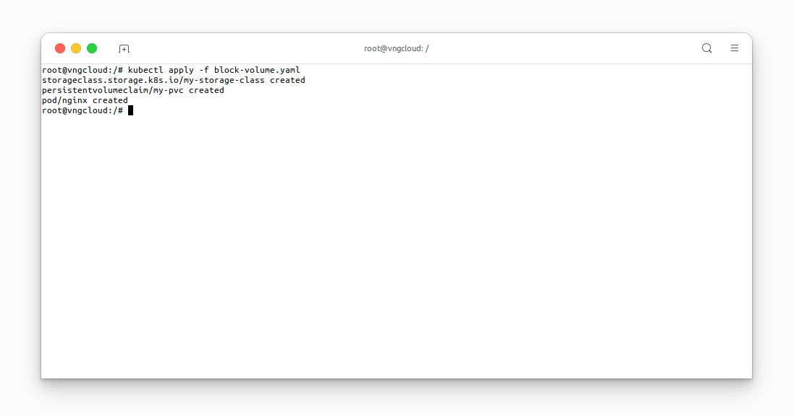
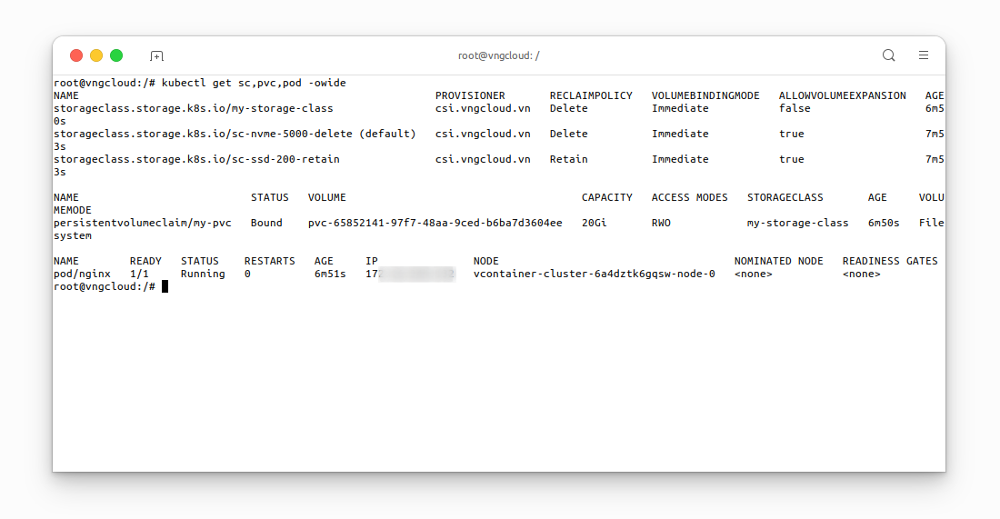

<div style="float: right;"></div><br>


# Block volume
The following manifest will first create a `StorageClass` named `my-storage-class` and subsequently generate a `PersistentVolumeClaim` named `my-pvc`. Finally, it will deploy an `nginx` `Pod` utilizing the aforementioned `PersistentVolumeClaim`:

***File [block-volume.yaml](https://github.com/vngcloud/vcontainer-helm-infra-documentation/blob/main/manifests/block-volume/block-volume.yaml)***
```yaml=
apiVersion: storage.k8s.io/v1
kind: StorageClass
metadata:
  name: my-storage-class                            # [1] The StorageClass name, CAN be changed
provisioner: csi.vngcloud.vn                        # The CSI driver name
parameters:
  type: vtype-6790f903-38d2-454d-919e-5b49184b5927  # Change it to your volume type UUID from portal
---

apiVersion: v1
kind: PersistentVolumeClaim
metadata:
  name: my-pvc                                      # [2] The PVC name, CAN be changed
spec:
  accessModes:
  - ReadWriteOnce                                   # MUST set this value, currently only support RWO
  resources:
    requests:
      storage: 20Gi                                 # [3] The PVC size, CAN be changed, this value MUST be in the valid range of the proper volume type
  storageClassName: my-storage-class                # MUST be same value with [1], not set this value will use default StorageClass
---

apiVersion: v1
kind: Pod
metadata:
  name: nginx
spec:
  containers:
  - image: nginx
    imagePullPolicy: Always
    name: nginx
    ports:
    - containerPort: 80
      protocol: TCP
    volumeMounts:
      - mountPath: /var/lib/www/html                # The mount path in container, CAN be changed
        name: my-volume-name                        # MUST be same value with [4]
  volumes:
  - name: my-volume-name                            # [4] The volume mount name, CAN be changed
    persistentVolumeClaim:
      claimName: my-pvc                             # MUST be same value with [2]
      readOnly: false
```

Apply the manifest:
```bash=
kubectl apply -f block-volume.yaml
```

<center>

  

</center>

Verify the associated resources within a few seconds:
```bash=
kubectl get sc,pvc,pod -owide
```

<center>

  

</center>

Users also can verify this `PersistentVolumeClaim` on the **VNG CLOUD portal**:

<center>

  

</center>
