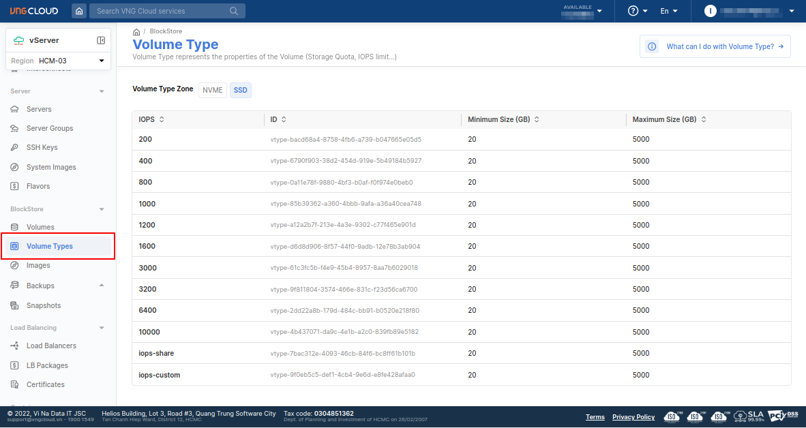

<div style="float: right;"></div><br>


# `StorageClass` based on Volume Type
The **VNG CLOUD storage service** provides support for a variety of **Volume Types**, each with distinct **Input/Output Operations Per Second (IOPS)** characteristics. Users can leverage these options to create `StorageClass` based on their specific requirements and application needs.

Users can explore the available options in [the Volume Type section](https://hcm-3.console.vngcloud.vn/vserver/block-store/volume-type) on **the VNG CLOUD portal**.<br>





The following example creates a `StorageClass` using an SSD drive with a base of 200 IOPS.

```yaml=
apiVersion: storage.k8s.io/v1
kind: StorageClass
metadata:
  name: my-storage-class                             # The StorageClass name, CAN be changed
provisioner: csi.vngcloud.vn                         # The CSI driver name
parameters:
  type: vtype-bacd68a4-8758-4fb6-a739-b047665e05d5   # An SSD drive with a base of 200 IOPS, CAN be changed
allowVolumeExpansion: true                           # MUST set this value to allow the Volume Expansion feature
```

The **vContainer Storage Interface** chart will generate two `StorageClasses` `sc-nvme-5000-delete` and `sc-ssd-200-retain`, with `sc-nvme-5000-delete` assigned as the default `StorageClass`:
```bash=
kubectl get sc -owide
```
  
  